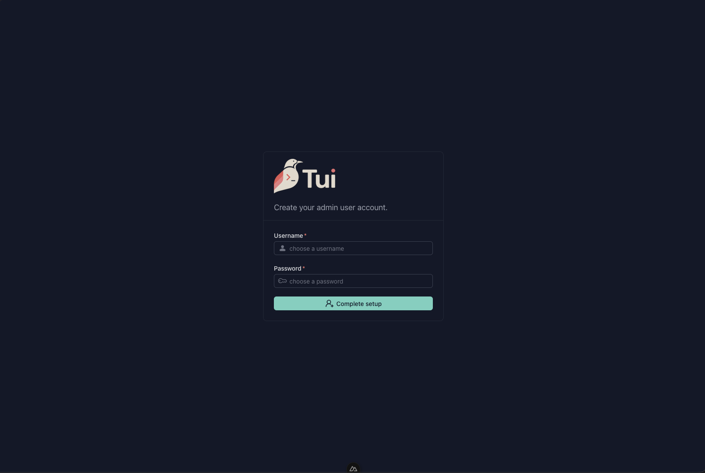
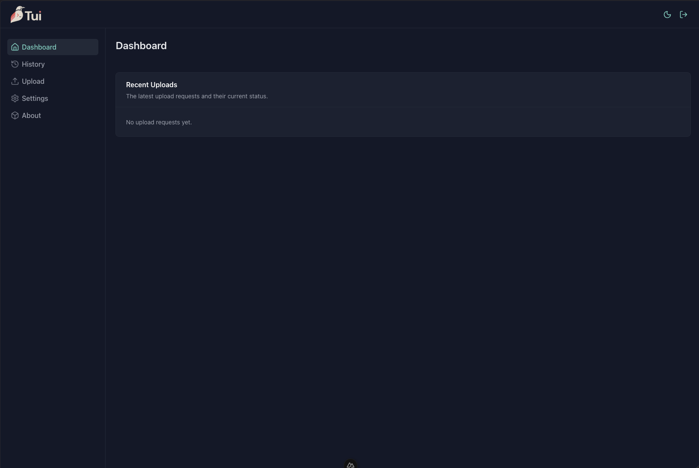
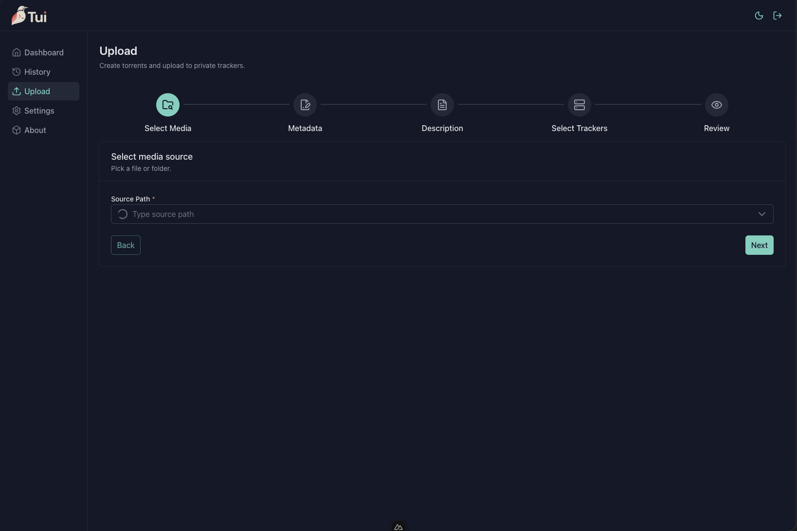
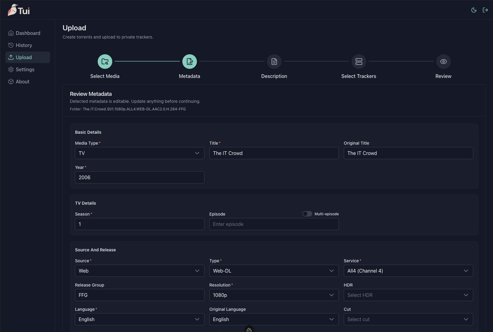
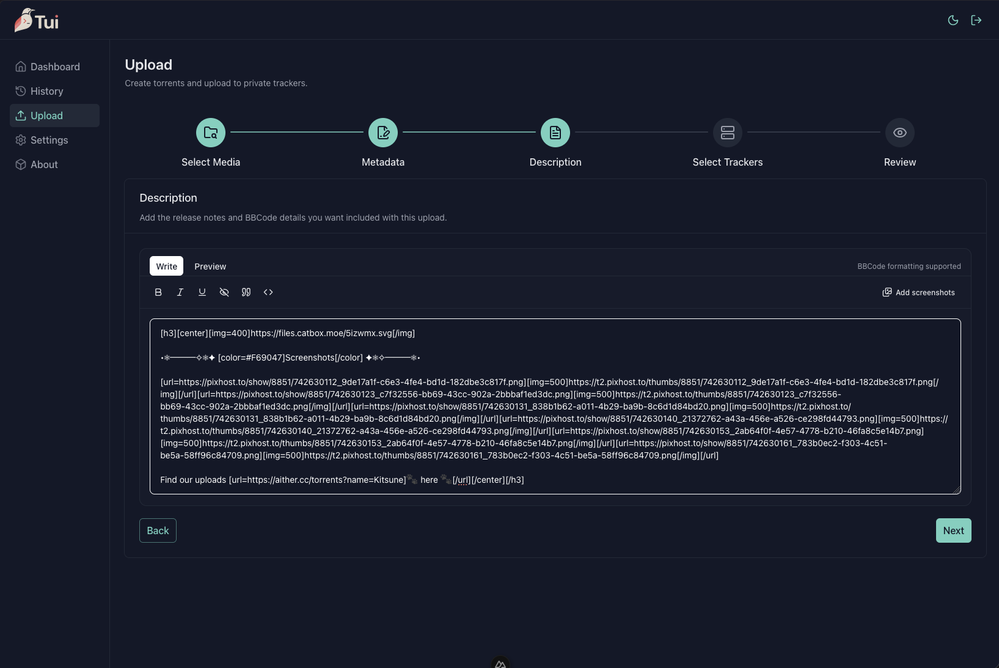
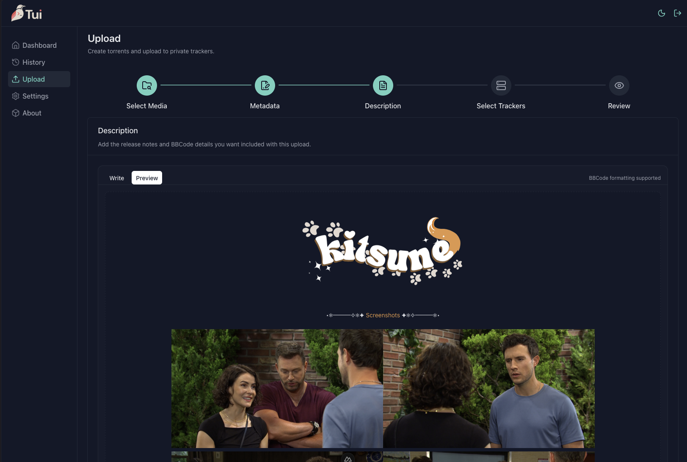
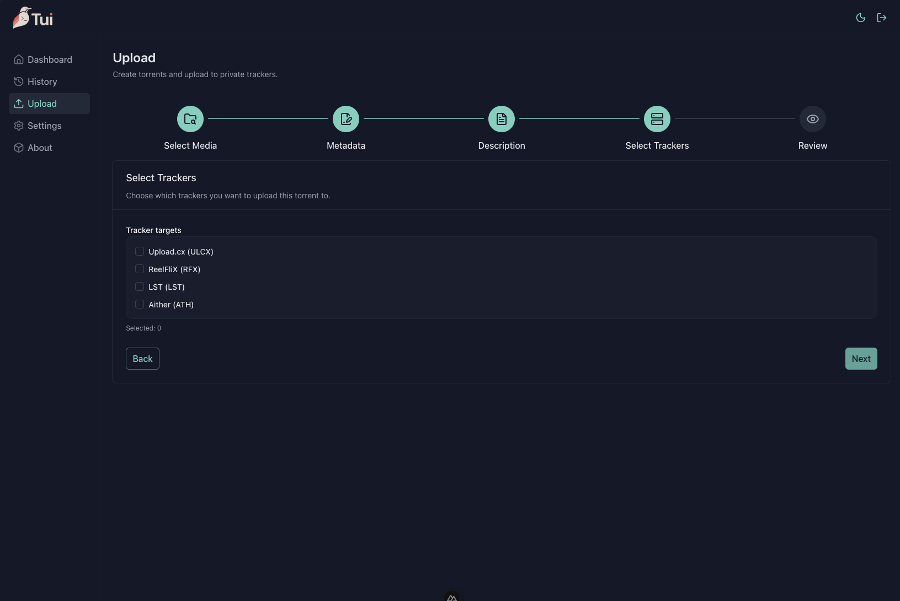
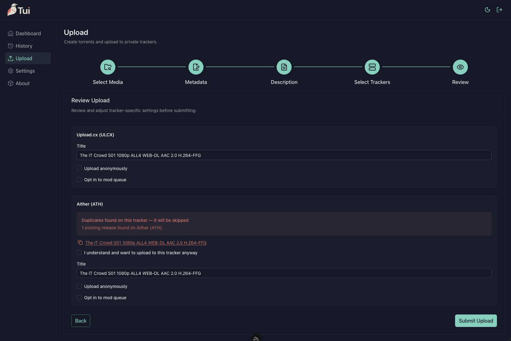
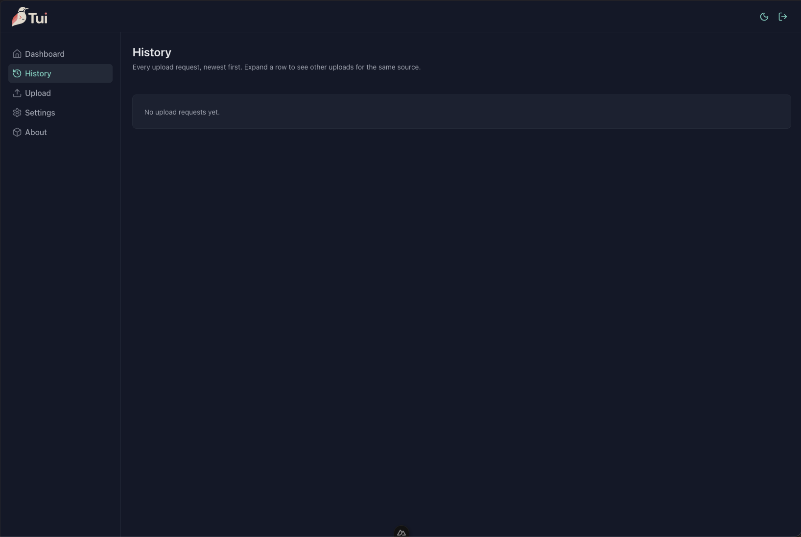
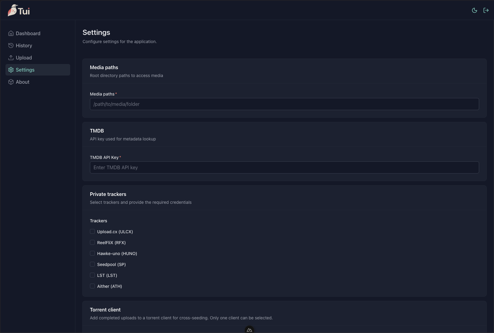

# tui

A self-hosted web application for uploading media to private BitTorrent trackers. Select a file or folder, review auto-detected metadata, write a BBCode description, and submit — tui handles torrent creation, duplicate checking, rule validation, and uploading in the background.

> **Current state:** Early development (v0.1.0). Core upload flow is functional. Tracker support is limited to UNIT3D-based trackers. Breaking changes between versions should be expected.

---

## Table of Contents

- [Features](#features)
- [Screenshots](#screenshots)
- [Supported Trackers](#supported-trackers)
- [Supported Integrations](#supported-integrations)
- [Getting Started](#getting-started)
    - [Docker (recommended)](#docker-recommended)
    - [Docker Compose](#docker-compose)
    - [Local Setup](#local-setup)
- [Configuration](#configuration)
- [Roadmap](#roadmap)
- [Contributing](#contributing)
- [Reporting Bugs & Feature Requests](#reporting-bugs--feature-requests)
- [Attributions](#attributions)
- [License](#license)

---

## Features

- **5-step guided upload flow** — Select media → Review/edit metadata → Write description → Pick trackers → Submit
- **Automatic metadata detection** — Parses filename, runs mediainfo, fetches TMDB/TVDB data to pre-fill resolution, codec, audio, HDR flags, and more
- **BBCode description editor** — Write and preview descriptions with a live BBCode renderer; a configurable footer is appended automatically
- **Screenshot capture** — Takes configurable number of screenshots via ffmpeg and uploads them to an image host; links are inserted into the description
- **Parallel tracker uploads** — Submits to multiple selected trackers concurrently
- **Pre-flight checks** — Duplicate detection and tracker rule validation before submission
- **Tracker-aware title generation** — Formats the torrent title according to each tracker's naming convention
- **Torrent caching** — Re-uploads of the same filepath reuse the already-created `.torrent` file
- **Live upload dashboard** — Polls every 2 seconds; shows progress, per-tracker results, and allows retrying failed uploads
- **Upload history** — Paginated history grouped by upload batch with filtering by group
- **Torrent client injection** — Pushes the download URL to a connected torrent client after a successful upload
- **Session-based auth** — Simple login with a single admin account; all routes are protected

---

## Screenshots

### Setup

<a href="docs/screenshots/setup.png"></a>

### Dashboard

<a href="docs/screenshots/dashboard.png"></a>

### Upload Flow

<a href="docs/screenshots/upload-select-media.png"></a> <a href="docs/screenshots/upload-edit-metadata.png"></a>
<a href="docs/screenshots/upload-edit-description.png"></a> <a href="docs/screenshots/upload-description-preview.png"></a>
<a href="docs/screenshots/upload-select-trackers.png"></a> <a href="docs/screenshots/upload-review.png"></a>

### History

<a href="docs/screenshots/history.png"></a>

### Settings

<a href="docs/screenshots/settings.png"></a>

---

## Supported Trackers

All current trackers run on the [UNIT3D](https://github.com/HDInnovations/UNIT3D-Community-Edition) platform. Each tracker has its own title format, rule validation, and duplicate detection logic built in.

| Tracker   | Code   | Platform |
| --------- | ------ | -------- |
| Aither    | `ATH`  | UNIT3D   |
| Upload.cx | `ULCX` | UNIT3D   |

## Supported Integrations

| Category            | Integration      | Notes                                |
| ------------------- | ---------------- | ------------------------------------ |
| **Metadata**        | TMDB             | Movie/show info, language lookup     |
| **Metadata**        | TVDB             | TV show metadata                     |
| **Image hosting**   | ImgBB            | Screenshot upload                    |
| **Torrent clients** | QUI              | Cross-seed injection via the QUI API |
| **Media analysis**  | ffmpeg / ffprobe | Screenshot capture, stream probing   |
| **Media analysis**  | mediainfo        | Detailed codec/format info           |

---

## Getting Started

### Prerequisites

- Docker (recommended path) **or** Node.js 22+ and pnpm 11

### Docker (recommended)

Pull and run the latest image:

```bash
docker run -d \
  --name tui \
  -p 4000:4000 \
  -v $(pwd)/config:/app/config \
  -v /path/to/media:/media \
  --restart unless-stopped \
  ghcr.io/tui-project/tui:latest
```

Open `http://localhost:4000` and complete the first-run setup wizard to create your admin account.

### Docker Compose

Create a `docker-compose.yml`:

```yaml
services:
    tui:
        image: ghcr.io/tui-project/tui:latest
        # or build from source:
        # build: .
        ports:
            - '4000:4000'
        volumes:
            - ./config:/app/config
            - /path/to/media:/media
        restart: unless-stopped
```

Then start it:

```bash
docker compose up -d
```

The `./config` directory on your host will hold the database, generated torrents, logs, and screenshots. Back it up regularly.

#### Volume layout

| Host path            | Container path          | Contents                                            |
| -------------------- | ----------------------- | --------------------------------------------------- |
| `./config/database/` | `/app/config/database/` | NeDB database files                                 |
| `./config/torrents/` | `/app/config/torrents/` | Generated `.torrent` files                          |
| `./config/logs/`     | `/app/config/logs/`     | Rotating server log (JSON)                          |
| `./config/tmp/`      | `/app/config/tmp/`      | Temporary screenshot files                          |
| `/path/to/media`     | `/media`                | Source media files (add to Media Paths in Settings) |

### Local Setup

#### 1. Clone and install

```bash
git clone https://github.com/tui-project/tui.git
cd tui
pnpm install
```

#### 2. Install system dependencies

tui requires **ffmpeg**, **ffprobe**, and **mediainfo** to be available on the host. You can either:

- Install them system-wide (`brew install ffmpeg mediainfo` on macOS, `apt install ffmpeg mediainfo` on Debian/Ubuntu)
- Or point to custom binary paths in the Settings page after first launch

#### 3. Start the dev server

```bash
pnpm dev
```

Open `http://localhost:3000`. The first request redirects to `/setup` to create your admin account.

#### 4. Build for production

```bash
pnpm build
node .output/server/index.mjs
```

The server listens on `0.0.0.0:3000` by default. Set `HOST` and `PORT` environment variables to override.

---

## Configuration

All settings are managed through the **Settings** page in the UI. Nothing requires editing config files by hand.

| Setting                          | Description                                                     |
| -------------------------------- | --------------------------------------------------------------- |
| **Media paths**                  | Directories the file browser exposes for source media selection |
| **TMDB API key**                 | Required for automatic metadata lookup and language lists       |
| **Trackers**                     | URL, API key, and passkey for each supported tracker            |
| **Image host**                   | ImgBB API key for screenshot uploads                            |
| **Torrent client**               | URL and API key for optional post-upload injection              |
| **ffmpeg / ffprobe / mediainfo** | Paths to binaries (leave empty to use `PATH`)                   |
| **Screenshot counts**            | How many screenshots to capture for movies vs. episode packs    |
| **Log level**                    | Runtime verbosity (trace → error)                               |

### Required API keys

Before you can upload, you'll need to obtain and enter the following in Settings:

- **TMDB API key** — get one at [themoviedb.org/settings/api](https://www.themoviedb.org/settings/api). Required for metadata lookups and language lists.
- **Tracker API key + pass key** — find these in your account settings on each tracker you want to upload to.
- **ImgBB API key** — get one at [imgbb.com/api](https://imgbb.com/api). Required for screenshot uploads.
- **QUI API key** — found in your QUI instance settings. Only needed if you want torrents automatically injected into your torrent client after upload.

---

## Roadmap

### v0.2 (next)

- [ ] Tracker support for Hawke-uno (HUNO), ReelFliX (RFX), LST, and seedpool (SP)
- [ ] Improved BBCode editor with toolbar shortcuts
- [ ] Search/filter on the history page
- [ ] Create a new upload from an existing one (pre-filled with previous data) from the history page
- [ ] Retry failed uploads from the history page

### Future

- [ ] Integration with torrent clients to identify possible uploads to configured trackers and provide easy upload steps
- [ ] NFO file upload support
- [ ] Uploading support for full discs
- [ ] More tracker support
- [ ] Grab upload description from configured trackers
- [ ] Re-use existing screenshots
- [ ] Anime support
- [ ] Additional image hosting providers (Imgur, Ptpimg, …)
- [ ] Additional torrent client integrations (qBittorrent, Deluge, …)
- [ ] Webhook notifications (Discord, etc.) on upload completion

> Have a feature idea? [Open a feature request](#reporting-bugs--feature-requests).

---

## Contributing

Contributions are welcome. Please read this section before opening a pull request.

### Development workflow

```bash
pnpm install        # install dependencies
pnpm dev            # start dev server at http://localhost:3000
pnpm typecheck      # TypeScript check (required before finishing any change)
pnpm lint           # ESLint
pnpm lint:fix       # ESLint with auto-fix
pnpm test           # unit + Nuxt component tests
pnpm test:unit      # unit tests only (fastest feedback loop)
pnpm test:coverage  # full coverage report
```

### Guidelines

- Follow the [Conventional Commits](https://www.conventionalcommits.org/) format: `type: short summary` (under 72 chars) followed by 1–2 sentences of context.
- All touched code paths must have 100% test coverage (branches, error paths, null guards included). Run `pnpm test:coverage` and verify before opening a PR.
- API routes must use Zod for request validation. Go through repositories, not collections directly.
- Composables follow the verb-prefix naming convention (`useGet*`, `usePost*`, `usePatch*`).
- See [CONTRIBUTING.md](./docs/CONTRIBUTING.md) for detailed conventions on routes, repositories, logging, and tests.

### Branching strategy

| Branch type    | Target    | When to use                                             |
| -------------- | --------- | ------------------------------------------------------- |
| `fix/<name>`   | `main`    | Bug fixes — merged directly so they ship immediately    |
| `feat/<name>`  | `release` | New features — batched on `release` until ready to ship |
| `chore/<name>` | `main`    | Dependencies, tooling, config                           |
| `docs/<name>`  | `main`    | Documentation only                                      |
| `ci/<name>`    | `main`    | CI/CD changes                                           |

After every fix lands on `main`, rebase the `release` branch onto `main` to keep it current.

When the features on `release` are ready to ship, open a PR from `release` → `main`. Merging triggers the release workflow which publishes a new Docker image.

### Opening a pull request

1. Fork the repository and create a `fix/*` or `feat/*` branch following the strategy above.
2. Make your changes with tests.
3. Run `pnpm typecheck && pnpm test:coverage` — both must pass cleanly.
4. Open a PR with a clear description of what changed and why. CI runs automatically and must pass before merging.

---

## Reporting Bugs & Feature Requests

Use [GitHub Issues](https://github.com/tui-project/tui/issues) for both.

**Bug reports** — include:

- tui version (visible on the About page)
- Steps to reproduce
- What you expected vs. what happened
- Relevant log output from `config/logs/server.log`

**Feature requests** — describe the use case, not just the desired UI change. Explain what problem you're trying to solve.

---

## Attributions

tui is built on top of these open-source projects:

<table>
  <tr>
    <td align="center" width="120">
      <a href="https://nuxt.com"><br /><sub><b>Nuxt</b></sub></a><br /><sub>MIT</sub>
    </td>
    <td align="center" width="120">
      <a href="https://ui.nuxt.com"><br /><sub><b>Nuxt UI</b></sub></a><br /><sub>MIT</sub>
    </td>
    <td align="center" width="120">
      <a href="https://vuejs.org"><br /><sub><b>Vue</b></sub></a><br /><sub>MIT</sub>
    </td>
    <td align="center" width="120">
      <a href="https://tailwindcss.com"><br /><sub><b>Tailwind CSS</b></sub></a><br /><sub>MIT</sub>
    </td>
    <td align="center" width="120">
      <a href="https://zod.dev"><br /><sub><b>Zod</b></sub></a><br /><sub>MIT</sub>
    </td>
    <td align="center" width="120">
      <a href="https://github.com/seald/nedb"><br /><sub><b>NeDB</b></sub></a><br /><sub>MIT</sub>
    </td>
    <td align="center" width="120">
      <a href="https://github.com/webtorrent/create-torrent"><br /><sub><b>create-torrent</b></sub></a><br /><sub>MIT</sub>
    </td>
    <td align="center" width="120">
      <a href="https://github.com/webtorrent/parse-torrent"><br /><sub><b>parse-torrent</b></sub></a><br /><sub>MIT</sub>
    </td>
    <td align="center" width="120">
      <a href="https://github.com/JiLiZART/BBob"><br /><sub><b>BBob</b></sub></a><br /><sub>MIT</sub>
    </td>
    <td align="center" width="120">
      <a href="https://github.com/unjs/consola"><br /><sub><b>consola</b></sub></a><br /><sub>MIT</sub>
    </td>
  </tr>
</table>

<table>
  <tr>
    <td align="center" width="120">
      <a href="https://www.themoviedb.org"><br /><sub><b>TMDB</b></sub></a>
    </td>
    <td align="center" width="120">
      <a href="https://thetvdb.com"><br /><sub><b>TheTVDB</b></sub></a>
    </td>
    <td align="center" width="120">
      <a href="https://ffmpeg.org"><br /><sub><b>FFmpeg</b></sub></a>
    </td>
    <td align="center" width="120">
      <a href="https://mediaarea.net/en/MediaInfo"><br /><sub><b>MediaInfo</b></sub></a>
    </td>
  </tr>
</table>

---

## License

tui is released under the [GNU General Public License v3.0](./LICENSE).
